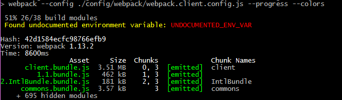

# document-env-vars

A webpack loader for making sure your README.md documents all the environment variables your code uses.

This loader allows Webpack to automatically warn you code that you apply this loader to extracts an enviroment variable out of `process.env` or by using `env.get()` that is not mentioned anywhere in your README.md, which is usually a sign that your PR, or even your codebase, is not properly documented yet, while making it trivial to figure out *which* env var you haven't mentioned so you can immediately add it.

## Install with npm

Installation is the same as for any other npm-managed package 

```
$> npm install document-env-vars --save-dev
```

If you use a different manager with the npm registry (such as yarn) please look up the equivalent syntax for this instruction for your tool of choice.

## Use as any other loader in your Webpack config

Use this webpack loader the same way you would any other loader. As an example:

```
  ...
  module: {
    loaders: [
      {
        test: /\.jsx?$/,
        loaders: [
          'babel-loader',
          'eslint-loader',
          'document-env-vars'
        ],
        exclude: /node_modules/
      },
      ...
    ]
  },
  ...
```

Remember that loaders work LIFO (last in, first out) so the last loader gets triggered first. This loader does not modify any files, so the order should not matter, but running it first by placing it at the end of your loader list means that it triggers on *your* code, not on any transpiled code, making it more reliable that warnings are for real environment variables, rather than bundle-shimmed variables or the like.  

## What do errors look like?

Coloured text. Hopefully, helpfully coloured:

 
